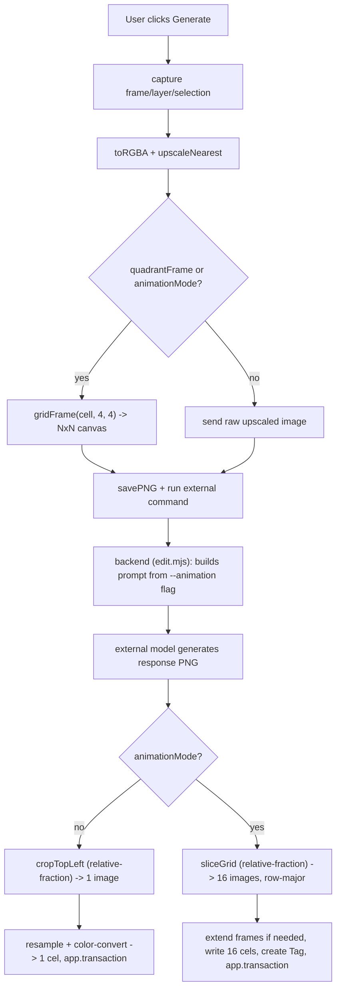

# 4x4 Grid + Animation Mode Design

**Spec**: `.specs/features/grid-4x4-animation/spec.md`
**Context**: `.specs/features/grid-4x4-animation/context.md`
**Status**: Draft

---

## Architecture Overview

Same pipeline as today, generalized from a 2x2/top-left-only grid to an NxN grid (N=4, hardcoded)
that can hold either one edit or 16 animation frames:

---

## Code Reuse Analysis

### Existing Components to Leverage

| Component | Location | How to Use |
| --- | --- | --- |
| `frameInQuadrant(cell)` | `kobixel.lua:327` | Generalize to `gridFrame(cell, cols, rows)`; single-edit mode calls it with `cols=4, rows=4` and places content in cell `(0,0)` only, exactly like today's `(0,0)` of a 2x2 |
| `cropTopLeft(img, w, h)` | `kobixel.lua:354` | Reused unchanged for single-edit mode's crop-back (it already works on any absolute cell size) |
| Relative-fraction crop math in `finalizeResult` | `kobixel.lua:482-484` | Same formula (`result.width * (cellWidth / canvasWidth)`) reused per-cell in the new `sliceGrid` function — this is the fix from 0.3.1 and must not regress |
| `BASE_PIXEL_ART_INSTRUCTIONS` / `buildPixelArtInstructions` | `edit.mjs:55-73` | Split into two branches (single-cell vs fill-all-cells) behind the same exported function, keeping the existing unit-testable shape |
| `optionalArg(name)` | `edit.mjs:42` | Reused as-is for parsing `--animation` |
| `fillTemplate` / DEFAULTS.command placeholder substitution | `kobixel.lua:68-72`, `kobixel.lua:13` | Add `{animation}` the same way `{width}`/`{height}` were added — no change to the substitution mechanism itself |
| `app.transaction` wrapping in `finalizeResult` | `kobixel.lua:490-507` | Animation branch writes all 16 cels + creates the Tag inside one transaction, same one-Ctrl+Z guarantee |
| Layer naming pattern `data.prompt:sub(1, 24)` | `kobixel.lua:493` | Same truncation pattern reused for the Tag's fallback/derived name |

### Integration Points

| System | Integration Method |
| --- | --- |
| Aseprite Lua API (`Sprite:newEmptyFrame`, `Sprite:newTag`, `Sprite:newCel`) | Documented at api.aseprite.org; see Tech Decisions below for the one behavior gap in that documentation and how the design avoids depending on it |
| `kobixel-gemini-web` CLI contract | Extended with one new optional flag (`--animation`), following the exact precedent of `--width`/`--height` |

---

## Components

### `gridFrame(cell, cols, rows)` (replaces `frameInQuadrant`)

- **Purpose**: Build the NxN grid canvas, placing `cell` in the top-left grid position and
  leaving the rest white, separated by black interior gutters.
- **Location**: `kobixel.lua` (replaces `frameInQuadrant`, ~line 327)
- **Interfaces**:
  - `gridFrame(cell: Image, cols: number, rows: number): Image` — for this feature always
    called as `gridFrame(sent, 4, 4)`
- **Dependencies**: `Image`, `ImageSpec`, `pc` (app.pixelColor) — same as today
- **Reuses**: Same thickness formula (`math.max(2, math.floor(math.min(cell.width, cell.height)
  / 100))`), same white-background-then-draw-black-gutters approach, generalized from "1 vertical
  + 1 horizontal divider" to "`cols-1` vertical + `rows-1` horizontal interior dividers".
  Total canvas size: `w = cell.width * cols + thickness * (cols - 1)`,
  `h = cell.height * rows + thickness * (rows - 1)`.

### `sliceGrid(img, cellWidth, cellHeight, canvasWidth, canvasHeight, cols, rows)` (new)

- **Purpose**: Extract all `cols * rows` cells from the response image in row-major order
  (left-to-right, top-to-bottom), using the same relative-fraction technique that
  `finalizeResult` already uses for the single-cell crop (see 0.3.1 CHANGELOG entry) — the model
  doesn't always return the exact canvas size sent.
- **Location**: `kobixel.lua`, near `cropTopLeft`
- **Interfaces**:
  - `sliceGrid(img: Image, cellWidth: number, cellHeight: number, canvasWidth: number,
    canvasHeight: number, cols: number, rows: number): Image[]` — returns a flat array of
    `cols * rows` images in row-major order
- **Dependencies**: `Image`, `ImageSpec`
- **Reuses**: The exact fraction formula from `finalizeResult:482-484`
  (`result.width * (cellWidth / canvasWidth)`), applied per-cell with an `(x, y)` offset
  computed the same way `gridFrame` computed each cell's origin (cell index × (cell size +
  thickness), scaled by the same width/height ratio as the crop size itself, so gutters scale
  along with content instead of drifting).

### `finalizeResult` (modified)

- **Purpose**: Unchanged responsibility (bring the result back into the sprite inside one
  transaction), but branches on `data.animationMode`.
- **Location**: `kobixel.lua:466`
- **Interfaces**: Signature gains `animationDescription` is NOT needed here (only used
  pre-request, for the prompt/flag) — `finalizeResult` only needs `data.animationMode` (already
  part of `data`) plus the existing params. No new positional params beyond what grid-size
  changes already require (`cellWidth`/`cellHeight`/`canvasWidth`/`canvasHeight` stay, now
  computed against a 4x4 canvas instead of 2x2).
- **Non-animation branch**: unchanged logic, just fed 4x4-grid-derived fractions instead of
  2x2-derived ones (no code change needed here beyond what `gridFrame`/`run` already produce).
- **Animation branch** (new):
  1. `local cells = sliceGrid(result, sent.width, sent.height, toSend.width, toSend.height, 4, 4)`
  2. For each of the 16 cells: `resampleTo` + `toSpriteColorMode`, same as the single-result path.
  3. Ensure the sprite has enough frames: `while #sprite.frames < frameNumber + 15 do
     sprite:newEmptyFrame(#sprite.frames + 1) end` — **always appends at the true end**
     (`#sprite.frames + 1`), never inserts at `frameNumber` or any position that could shift
     existing frames. See Tech Decisions for why.
  4. Inside `app.transaction`: for `i = 0, 15`, resolve the target layer (create once via
     `sprite:newLayer()` if `data.target == "new_layer"`, else `targetLayer`) and call
     `sprite:newCel(layer, frameNumber + i, cells[i+1], Point(rect.x, rect.y))` — same call shape
     already used today (Aseprite's `newCel` is documented to work on an existing frame number,
     which step 3 guarantees).
  5. `local tag = sprite:newTag(frameNumber, frameNumber + 15); tag.name =
     (data.animationDescription ~= "" and data.animationDescription or "Kobixel animation")
     :sub(1, 24)`.

### Dialog changes (`showDialog`)

- **Purpose**: Add Animation mode UI, lock the grid checkbox while it's active.
- **Location**: `kobixel.lua:678` (`showDialog`)
- **Interfaces** (Aseprite `Dialog` widgets, all existing widget types already used elsewhere in
  this file — no new widget kinds):
  - `dlg:check{ id = "animationMode", text = "Generate 16-frame animation (fills all grid
    cells)", selected = saved.animationMode, onclick = ... }`
  - `dlg:entry{ id = "animationDescription", label = "Animation description:", text =
    saved.animationDescription }`
  - The `animationMode` checkbox's `onclick` handler calls `dlg:modify{ id = "quadrantFrame",
    selected = true, enabled = not checked-state }` — locking the existing grid checkbox on
    while Animation mode is active (Dialog:modify with `enabled=`/`selected=` is the same API
    already implicitly available via `dlg:modify{ id = "status", text = ... }` used in the
    progress dialog at `kobixel.lua:665`, just with different attribute keys).
- **Dependencies**: none new
- **Reuses**: Existing preferences persistence loop (`for k, v in pairs(DEFAULTS) do ... end`) —
  just add `animationMode = false` and `animationDescription = ""` to `DEFAULTS`.

### `edit.mjs` prompt building (modified)

- **Purpose**: Branch the instruction text on whether `--animation` was given.
- **Location**: `tools/kobixel-gemini-web/edit.mjs:55-73`
- **Interfaces**:
  - `buildPixelArtInstructions({ width, height, animation } = {}): string` — `animation` is the
    new optional 4th input (a string; empty/undefined = single-edit mode).
  - Two exported base-instruction constants instead of one, so `edit.test.mjs` can assert exact
    equality on each branch the same way it does today:
    - `BASE_PIXEL_ART_INSTRUCTIONS` (single-edit, 16-cell wording) — same sentence as today,
      numbers updated per context.md's "no other added instruction" decision.
    - `ANIMATION_PIXEL_ART_INSTRUCTIONS` (fill-all-16-cells wording, includes the animation
      description when present).
- **Dependencies**: none new
- **Reuses**: `optionalArg("animation")` in `main()`, same pattern as `optionalArg("width")`.

---

## Data Models

Not applicable — no persistent data model beyond the existing `plugin.preferences.cfg` table,
which gains two new keys (`animationMode: boolean`, `animationDescription: string`).

---

## Error Handling Strategy

| Error Scenario | Handling | User Impact |
| --- | --- | --- |
| Response image can't be sliced into 16 non-degenerate cells (e.g. model returned something tiny) | `sliceGrid`'s fraction math still runs; a near-zero-size cell just produces a near-zero-size result image, which `resampleTo` already handles (it doesn't special-case size 0 today either — same risk profile as the existing single-cell path, not a new failure mode) | Same as today's existing "the model ignored the framing" risk — visible as garbled output, not a crash |
| Sprite is closed / becomes invalid during the 30-90s wait | Already caught by the existing `pcall(finalizeResult, ...)` wrapper in `onSuccess` (`kobixel.lua:633`) — animation branch runs inside that same pcall, no new handling needed | Alert with the pcall error message, same as today |
| `data.animationDescription` contains shell metacharacters | Passed through `escapeForShell` before template substitution, same as `data.prompt` today | No shell injection risk, consistent with existing prompt handling |

---

## Tech Decisions (only non-obvious ones)

| Decision | Choice | Rationale |
| --- | --- | --- |
| Frame insertion strategy | Always grow the timeline by appending empty frames at `#sprite.frames + 1` in a loop, never call `newEmptyFrame`/`newFrame` at a mid-timeline position | Aseprite's official API docs (api.aseprite.org, checked live) don't specify whether `newEmptyFrame(frameNumber)` inserts-and-shifts or requires the position to already exist beyond the current count. Rather than assume, the design never needs that behavior: appending at the true end is unambiguous under any interpretation, and `newCel(layer, frameNumber, ...)` targeting an already-existing frame number is the exact call shape the current code already uses successfully. |
| No auto-adjustment of "Upscale before sending" for the 4x4 grid's larger area | Leave the slider fully manual, as today | User didn't request this; the existing slider already gives full control, and adding size-based auto-logic is exactly the kind of unrequested complexity CLAUDE.md's project conventions discourage. Documented as a known limitation instead (spec.md Edge Cases). |
| `{animation}` always substituted (even as `""`) rather than a separate boolean flag | Mirrors the existing `{width}`/`{height}` pattern exactly | Consistency with an already-validated convention; `optionalArg` already treats a missing/empty value as "off" so no new parsing concept is introduced. |
| Grid checkbox is forced-on (not hidden) while Animation mode is active | `dlg:modify{ enabled = false, selected = true }` rather than removing/hiding the widget | Keeps the dialog layout stable (no widgets appearing/disappearing beyond the new Animation fields) and makes it visually explicit *why* the checkbox can't be unchecked, rather than silently ignoring its value. |
| Tag creation happens after all 16 cels are written, inside the same `app.transaction` | Single transaction covers frame creation + cel writes + tag creation | Matches the existing one-Ctrl+Z guarantee this codebase already promises for every other code path. |

---

## Tips (carried from spec/context, not new)

- Single-edit mode must not regress: same relative-fraction crop, same "no other instruction"
  wording change — verify manually in Aseprite per CLAUDE.md's existing verification process
  before touching animation-specific code.
- `edit.test.mjs` is the only automated safety net here (Lua has none) — both instruction
  branches must get exact-equality tests, per CLAUDE.md's own note about avoiding regex-based
  assertions on this file.
