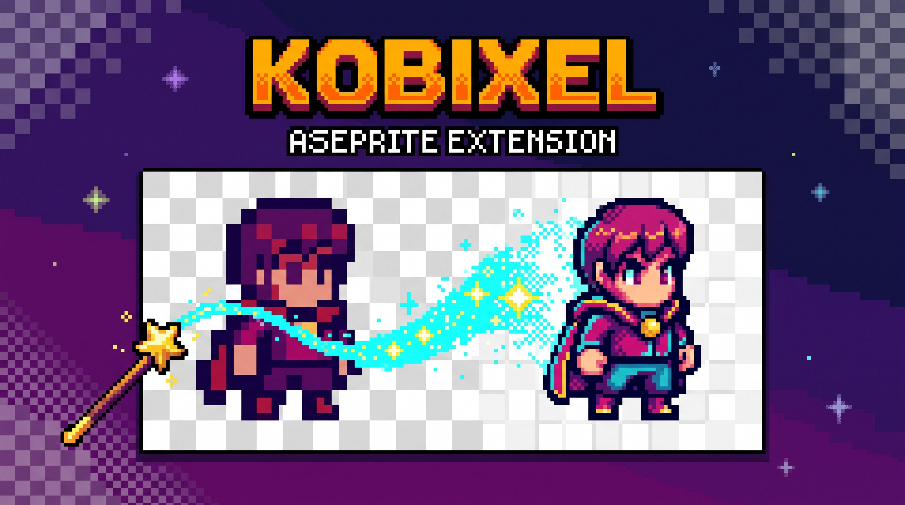

*[Leia em português](README.pt-BR.md)*

# Kobixel — Aseprite extension

</img>

**Kobixel** comes from *kobo* (工房), Japanese for "workshop"/"atelier", plus
*pixel* — a workshop for your pixel art, built as an Aseprite extension.

Takes the current sprite (or the cel/selection), exports it to PNG, calls a
local image-generation CLI with your prompt, and applies the result back
into the sprite — into a new layer or replacing the current cel. All inside
a single `app.transaction`, so `Ctrl+Z` undoes everything at once.

There is exactly **one** real extension in this project: the
`kobixel-X.Y.Z.aseprite-extension`, installed inside Aseprite. Nothing
here depends on installing anything in Chrome.

## Current status

The Aseprite extension exports the PNG, runs **any external command**
configured in the dialog's "External command" field, and brings the result
back. `tools/kobixel-gemini-web/` (below) is today's default
command and the only path that uses the Gemini Pro subscription's image
quota without an API key. Other options investigated, and why they aren't
the recommendation:

| Option | Result |
|---|---|
| `tools/kobixel-gemini-web/` (Playwright + an already-logged-in Chrome) | **Recommended.** No API key, uses the Gemini Pro subscription. ~20-40s per edit. See setup below. |
| `tools/gemini_edit.py` (direct Gemini API) — **removed from the repo** | Required an API key from [AI Studio](https://aistudio.google.com/apikey) with **billing enabled** — no free tier for image models, and didn't use the Gemini Pro subscription. Removed for that reason; the code is still in git history if you need it. |
| `tools/gemini-edit.ps1` (`gemini` CLI + nanobanana extension) — **removed from the repo** | Didn't work: Google discontinued the `gemini` CLI's free login (`IneligibleTierError`), and the nanobanana extension also required its own paid API key. Removed for that reason; the code is still in git history if you need it. |
| Automation via a Claude agent (`claude --chrome -p`) | Works, but ~5min and ~US$1 of Claude subscription usage per edit — tested and discarded for cost/latency in favor of driving Playwright directly. |
| `nanobanana` / `nano-banana-cli` (third-party CLIs) | Just the field's original example — needs installing and configuring, not a ready-made solution. |

**Note**: `tools/gemini_edit.py` and `tools/gemini-edit.ps1` were removed
from this repo (both required a paid API key, and the second was already
broken). If your "External command" field still points at either one,
replace it with the `edit.mjs` command — see "The CLI" below.

**Known limitation of every path**: Nano Banana doesn't expose a real alpha
channel through any tested route (download, clipboard, or extracting via
canvas). Asking for a "transparent background" in the prompt only produces
an opaque white/checkered background. Remove the background manually in
Aseprite (magic wand) when you need transparency.

## Installation

1. Build the `.aseprite-extension` with the release script:
   ```powershell
   .\release.ps1
   ```
   This bumps `version` in `package.json` (patch by default), deletes old
   builds, and generates `kobixel-X.Y.Z.aseprite-extension` at the repo
   root. See "Building a new release" below for more options.
2. In Aseprite: `Edit > Preferences > Extensions` → **remove the old
   version** first (avoids caching) → `Add Extension` → pick the new
   `.aseprite-extension`.
3. Restart Aseprite. The command appears under `Edit > Kobixel...`.

On first run, Aseprite will ask permission for the script to write files
and run commands. Check the option to fully trust the script, or the
dialog will show up on every call.

## Building a new release

After editing `kobixel.lua`, run:

```powershell
.\release.ps1                # bumps the patch: 0.1.0 -> 0.1.1 (default)
.\release.ps1 -Bump minor    # 0.1.0 -> 0.2.0
.\release.ps1 -Bump major    # 0.1.0 -> 1.0.0
```

This does everything: bumps the version number in `package.json`, deletes
any old `.aseprite-extension` at the root, and builds the new zip.

**Why you must always bump the version**: Aseprite identifies the extension
by the `name` field in `package.json`, not by the filename — it only shows
an update if `version` is higher than what's installed. Reinstalling
without bumping the version looks like it does nothing, even with a really
changed `.lua` file (this is exactly the bug the script avoids).

If you'd rather do it by hand instead of using the script:
```powershell
# edit "version" in package.json by hand first
Compress-Archive -Path package.json, kobixel.lua -DestinationPath kobixel-X.Y.Z.zip -Force
Rename-Item kobixel-X.Y.Z.zip kobixel-X.Y.Z.aseprite-extension
```

## The CLI

The plugin doesn't talk to Google's API directly — it runs a shell command.
The template is editable in the dialog and accepts these placeholders:

| Placeholder | Becomes |
|---|---|
| `{input}`  | path to the PNG exported from the sprite |
| `{output}` | path where the CLI **must** write the result |
| `{prompt}` | your prompt, already escaped |
| `{width}` / `{height}` | dimensions of the sent PNG |

Working example (the ready-made script from this repo — see setup below):

```sh
node "C:\path\to\tools\kobixel-gemini-web\edit.mjs" --in "{input}" --out "{output}" --prompt "{prompt}" --width "{width}" --height "{height}"
```

`--width`/`--height` are optional: `edit.mjs` uses them to tell Gemini the
real size of the PNG sent (instead of a fixed value), and it keeps working
normally if you omit both.

Before pasting the command into the plugin's field, **test the script
directly in a terminal** with any PNG — that way errors show up in the
terminal instead of in a truncated Aseprite dialog.

### `tools/kobixel-gemini-web/` (recommended)

Drives a Chrome window **you open and log into yourself**, via Chrome's
debug port (`--remote-debugging-port`) — uses no API key at all, just the
image quota from your Gemini Pro/Ultra subscription through the website.

Why it isn't simpler than this: Google blocks Google-account sign-in from a
browser that automation itself opened ("This browser or app may not be
secure"), even with a real Chrome binary — it's a defense against
automated logins, not a bug. The way around it is to never let the
automation log in: you log in by hand in a Chrome window you opened, and
the script only **connects** to that already-authenticated instance.

**Setup (once):**

```sh
cd tools/kobixel-gemini-web
npm install
```

**Before each usage session** (or just leave this window always open), open
Chrome yourself with the debug port:

```powershell
"C:\Program Files\Google\Chrome\Application\chrome.exe" --user-data-dir="%USERPROFILE%\.kobixel\chrome-profile" --remote-debugging-port=9222 https://gemini.google.com/app
```

The first time, log in normally in that window. The session is saved in
that dedicated profile (separate from your everyday Chrome), so next time
it opens already logged in — but **the window needs to stay open** while
you use the plugin; the script connects to it, it doesn't open its own.

If the script can't connect (`Could not connect to Chrome's debug port`),
it's because that window isn't open or was closed — open it again.

### PATH

`os.execute` inherits Aseprite's own process environment. If you opened
Aseprite via a graphical launcher or Steam, `PATH` probably lacks things
like `~/.local/bin` or nvm's node. **Use an absolute path to the binary**
in the template if you get "command not found".

## Proximity factor

The "Proximity factor" slider (0-100) controls how closely the result
should resemble the original sprite, versus prioritizing what was asked in
the prompt. There's no "strength"/"denoise"-style
parameter in Gemini's API or UI for this — the slider turns into a text
instruction (in English, alongside the prompt) that changes depending on
the range:

| Range | Instruction |
|---|---|
| 90-100 | Preserve pose, proportions, composition, and silhouette; only apply the requested change. |
| 60-89 | Stay reasonably close to the original composition, but adjust details freely. |
| 30-59 | Use the drawing only as a loose reference (general shape/palette); can reinterpret significantly. |
| 0-29 | Use the drawing only as color/style inspiration; prioritize the prompt over the original composition. |

This is only text guidance for the model — it may not follow it strictly,
especially near the extremes.

## Usage tips

- **Upscale before sending**: image models work at ~1024px. Sending a raw
  32×32 PNG gives a bad result. The default (8×) sends 256×256 with nearest
  neighbor, preserving the pixel grid.
- **Lock colors to the palette**: essential for indexed sprites and to keep
  the original palette on RGB sprites.
- **Downscale with Average** tends to beat Point when the model returns art
  with anti-aliasing; **Point** wins when it returns clean pixel art.
- Explicitly ask in the prompt: *"pixel art, {width}x{height} grid, no
  anti-aliasing, flat colors"*. Don't ask for a transparent background —
  Nano Banana doesn't return real alpha (see "Current status" above); it
  comes back with an opaque white/solid background, which you can remove
  afterward with the magic wand.

## Progress and execution

The external command runs in the background (via PowerShell's
`Start-Process` on Windows — unique filenames per run, see "Debug" below),
so it doesn't block Aseprite's UI. While it runs, a dialog shows the log's
last line and elapsed time (with a "Cancel" button to stop waiting, without
killing the process itself). `tools/kobixel-gemini-web/edit.mjs` prints step
markers (`[3/6] Uploading input image...` etc.) that show up in that
dialog — if you use a different external command, it'll only show whatever
that command itself prints to the log.

Total wait timeout: 3 minutes (`MAX_WAIT_SECONDS` in the `.lua`). If the
external command finishes without producing `{output}` — or the timeout is
exceeded — the progress dialog closes and shows the full log in an alert.

## Debug

- Log per run: `<temp>/aseprite-kobixel/kobixel-<stamp>.log` (one file per
  run — a fixed name would let a second generation corrupt the first run's
  `.bat` while it's still running in the background).
- Input/output PNGs live in the same folder (`in-*.png`, `out-*.png`) —
  Aseprite doesn't expose `os.remove`, so they aren't deleted automatically.
- Lua error console: `View > Developer Console`.
- Only one generation can run at a time (the plugin blocks a second one
  while the first hasn't finished).

## Known limitations

- Resampling is done in pure Lua, pixel by pixel. A 1024×1024 image takes a
  few seconds (this still runs synchronously, after the external command
  has already finished).
- Requires Aseprite 1.3+.
